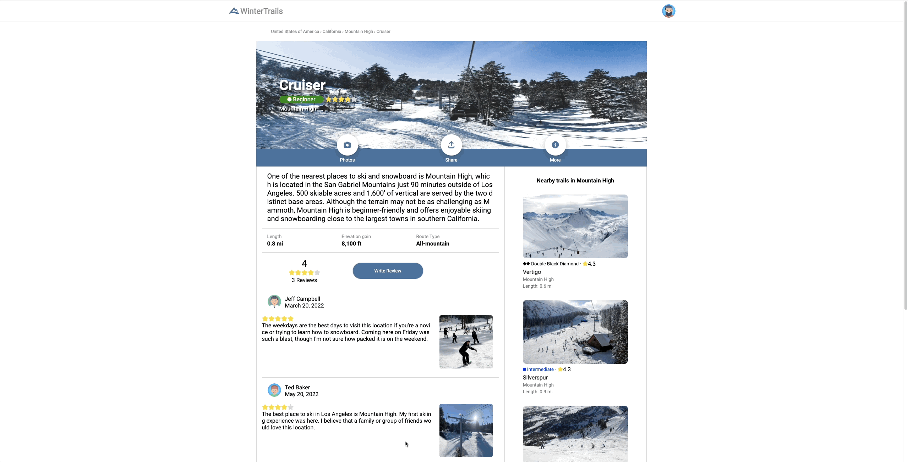
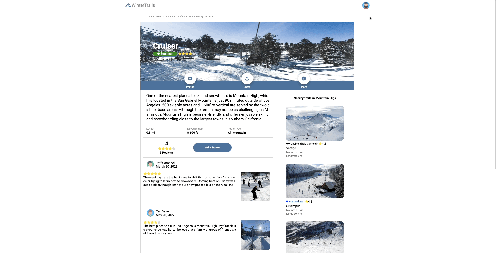

# WinterTrails 🗻

WinterTrails is a web-application clone inspired by [AllTrails](https://www.alltrails.com/), that allows users to find snowboarding/skiing trails within a resort across the U.S.A.

####  [WinterTrails](https://winter-trails-capstone.herokuapp.com/)

### Please see below links to Project Wiki:
##### [API Documentation](https://github.com/kevykim/CapStone-Project/wiki/API-Documentation)
##### [Database Schema](https://github.com/kevykim/CapStone-Project/wiki/DB-Schema)
##### [Features](https://github.com/kevykim/CapStone-Project/wiki/Features)
##### [Redux State](https://github.com/kevykim/CapStone-Project/wiki/Redux-State)
##### [User Story](https://github.com/kevykim/CapStone-Project/wiki/User-Stories)
##### [Wireframe](https://github.com/kevykim/CapStone-Project/wiki/Wireframes)


### This project is built with:


# Run Locally
1. Clone the application
``` git clone https://github.com/kevykim/CapStone-Project.git ```
2. Create a .env file
- In the file, add the following:
    ```
    SECRET_KEY=<Your own SECRET KEY>
    DATABASE_URL=sqlite:///dev.db
    ```
    (Look at .env.example for reference)
3. Backend instruction:
- CD to the root folder 
- Run these commands
    ```
    pipenv install -r requirements.txt
    pipenv shell
    flask db upgrade
    flask seed all
    flask run
    ```
4. Frontend instruction:
- CD into the react-app folder
- Run these commands
    ```
    npm install
    npm start
    ```

# Features Direction
## HomePage


## Sign up and Log in


## Demo User


## Create trail


## Update and Delete trail


## Create review


## Update and Delete review


# Future Focus
- Add a search bar where users can look up by the name of a trail, state, or country.
- Add google maps for users to keep track of where they are and see other trails nearby.
- Add weather api so that users can see the weather conditions within a specific trail.
- Work on community feature where all users can meet and post comments/pictures in their own community page.
- Work on shop feature where users can only purchase products that is enlisted by WinterTrails store. 

# Credit
<details>
<summary>Pictures used</summary> 

https://cms.rideboreal.com/sites/boreal/files/inline-images/Boreal%20Trail%20Map.jpg

https://static.evo.com/content/travel-guides/tahoe/heavenly/heavenly_trailmap.jpg

https://static.evo.com/content/travel-guides/ca/mammoth/mammoth_wintertrailmap_frontside.jpg

https://static.evo.com/content/travel-guides/ca/bigbear/17_map-1.png

https://res.cloudinary.com/liftopia/image/upload/c_fit,d_defaults:default_logo_1.png,f_auto,h_980,q_auto,w_980/v1/production/trail_maps/d05e41c2b8d2114c7a98a1a0154f38c5.jpg

https://www.pngkit.com/png/full/128-1280585_user-icon-fa-fa-user-circle.png

https://upload.wikimedia.org/wikipedia/commons/thumb/5/55/Boreal_Mountain_Resort_-_panoramio.jpg/1200px-Boreal_Mountain_Resort_-_panoramio.jpg

https://wanderjobs.com/wp-content/uploads/2019/08/Heavenly-2.jpg

https://freeskier.com/wp-content/uploads/2017/02/Mammoth1_Social.jpg

https://www.mtnscoop.com/media/images/2018/12/Big-Bear-Mountain-1024x478.jpg

https://dangerouscupcakelifestyle.com/wp-content/uploads/2019/01/skiing1.jpg

https://www.nationsonline.org/maps/USA/California_map.jpg

https://www.outsideonline.com/wp-content/uploads/2019/02/21/snowboard-instructor-fail_s.jpg

https://encrypted-tbn0.gstatic.com/images?q=tbn:ANd9GcRPa4_Kyvffe_glSxOxK6jNM54hOHPHxuXAso_XuTVQ2c1tO59glVHLXyFbTvx68Q6Veqs&usqp=CAU

https://www.wheredoitakethekids.com/wp-content/uploads/2019/12/borealMountain-13-scaled.jpg

https://whitebookski.com/wp-content/uploads/2017/04/shred-2.jpg

https://cdn.sierrasun.com/wp-content/uploads/sites/4/2016/08/SS_SS200910911129994AR.jpg

https://www.babyquip.com/blog/wp-content/uploads/2020/01/heavenly-16.jpg

https://img.theepochtimes.com/assets/uploads/2021/03/14/son.jpg

https://images.squarespace-cdn.com/content/v1/5f379d0d4c13b4408dddc875/1598773748886-667UP3XZH04ZQNHB06VT/heavenly-ski-resort-lake-tahoe-usa-02.jpg

https://mytahoeskicabin.com/wp-content/uploads/sites/4/2015/05/tahoe-ski-cabin-activities-heavenly-mountain-resort.jpg

https://cache.undercovertourist.com/blog/2019/04/0419-heavenly-gondola-view-768x512.jpg

https://s3-media0.fl.yelpcdn.com/bphoto/WZc1tl0yxOvc1t5mzXebGQ/o.jpg

https://s3-media0.fl.yelpcdn.com/bphoto/usBuL4ltcIVSdkAdJE72sA/o.jpg

https://s3-media0.fl.yelpcdn.com/bphoto/2-meqoylLHUj72tb3rhpyA/o.jpg

https://www.athletesinsight.com/wp-content/uploads/2018/02/DSC01031-2-1024x683.jpg

https://upload.wikimedia.org/wikipedia/commons/thumb/5/55/Boreal_Mountain_Resort_-_panoramio.jpg/1200px-Boreal_Mountain_Resort_-_panoramio.jpg

https://www.athletesinsight.com/wp-content/uploads/2018/02/DSC01027-2-1024x683.jpg

https://d6qyz3em3b312.cloudfront.net/upload/images/media/2012/01/10/5470668716_572860471a_b.2048x1024.jpg

https://s3-media0.fl.yelpcdn.com/bphoto/VcLrnqaUSpeGH35ry4sSXw/o.jpg

https://s3-media0.fl.yelpcdn.com/bphoto/uM9jucwJH6SfhVr-_6di9Q/o.jpg

https://fox40.com/wp-content/uploads/sites/13/2021/10/boreal.jpg

https://s3-media0.fl.yelpcdn.com/bphoto/8BjsoIFWF25Ve7ov_Dl2tg/o.jpg

https://cdn.sierrasun.com/wp-content/uploads/sites/4/2017/11/BorealOpener-SSU-111017-1.jpg

https://whitebookski.com/wp-content/uploads/2017/04/getting-to-boreal.jpg

https://snowboardmag.com/wp-content/uploads/2014/11/bear-mountain-snow-summit-opening-day.jpg

https://media.tacdn.com/media/attractions-splice-spp-674x446/07/2a/5f/63.jpg

https://offloadmedia.feverup.com/secretlosangeles.com/wp-content/uploads/2021/01/23204050/133589607_883949509034939_190740308602357817_n-1024x682.jpg

https://psia-w.org/new/wp-content/uploads/2017/03/IMG_5805.jpg

https://www.tripsavvy.com/thmb/a16PhyBgUXDF18RzL3zZQdfJ9dc=/1500x0/filters:no_upscale():max_bytes(150000):strip_icc()/MountainHighFlickrGrahamCC2-0-56a3e74c5f9b58b7d0d45fd7-59c2987a0d327a001146e3e0.jpg

https://www.wikihow.com/images_en/thumb/9/94/Snowboard-Step-15-preview.jpg/550px-Snowboard-Step-15-preview.jpg

https://uploads.tapatalk-cdn.com/20170113/b60f52add2db4aa9bcbb33ede8454b63.jpg

https://www.snocountry.com/images/easyblog_articles/3808/b2ap3_thumbnail_Mt-High-Terrain.jpg

https://media.defense.gov/2010/Jan/29/212296/-1/-1/0/100129-M-3459B-003.jpg

https://s3-media0.fl.yelpcdn.com/bphoto/08Ksa114xzFkPUJ_RS20lQ/o.jpg

https://upload.wikimedia.org/wikipedia/commons/1/17/BorealSkiCA.jpg

https://whitebookski.com/wp-content/uploads/2017/04/shred-2.jpg

https://png.pngtree.com/png-vector/20190729/ourlarge/pngtree-mountains-nature-outdoor-sun-hiking-flat-color-icon-vector-png-image_1622135.jpg


https://dynamic-media-cdn.tripadvisor.com/media/photo-o/11/b6/9c/d7/new-year-s-eve-skiing.jpg?w=1200&h=-1&s=1

https://d3ne5s9fv9p81l.cloudfront.net/public/wt/ac/58/20191219070340113759839.jpg?imageView2/2/format/auto

https://www.bigbear.com/imager/s3_us-west-1_amazonaws_com/big-bear/images/old-site-images/Winter-Activities_bc0d2157d501d4729a3d5631708a6b2e.jpg


https://www.bigbear.com/imager/files_idss_com/C347/9805d1cb-5037-45d6-a8c4-da836fa31ad0_cf127ca3a98712e9d52213b1386347a9.jpg

https://static.evo.com/content/travel-guides/ca/bigbear/bmjoesexton-1.jpg

https://www.destinationbigbear.com/blog/wp-content/uploads/2015/02/trouble-on-the-slopes.jpg

https://snowbrains.com/wp-content/uploads/2022/03/SCR-20220323-l41.jpeg


https://cdn4.iconfinder.com/data/icons/avatars-xmas-giveaway/128/hipster_beard_male_man-512.png

https://cdn4.iconfinder.com/data/icons/avatars-xmas-giveaway/128/female_woman_avatar_portrait-512.png

https://cdn4.iconfinder.com/data/icons/avatars-xmas-giveaway/128/afro_man_male_avatar-512.png

https://cdn4.iconfinder.com/data/icons/avatars-xmas-giveaway/128/man_male_avatar_portrait-512.png

https://cdn4.iconfinder.com/data/icons/avatars-xmas-giveaway/128/boy_male_avatar_portrait-512.png

https://cdn4.iconfinder.com/data/icons/avatars-xmas-giveaway/128/female_woman_avatar_portrait_1-512.png

https://cdn4.iconfinder.com/data/icons/avatars-xmas-giveaway/128/indian_man_male_person-512.png

https://cdn4.iconfinder.com/data/icons/avatars-xmas-giveaway/128/old_man_male_portrait-512.png

https://cdn4.iconfinder.com/data/icons/avatars-xmas-giveaway/128/punk_man_person_avatar-512.png

https://cdn4.iconfinder.com/data/icons/avatars-xmas-giveaway/128/boy_person_avatar_kid-512.png


</details>